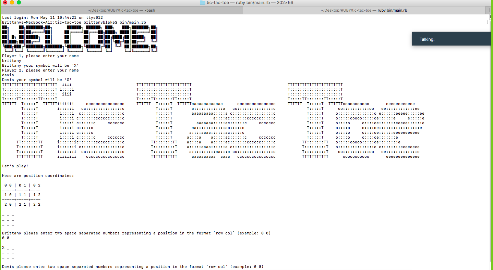

# tic-tac-toe

<!--
*** Thanks for checking out this README Template. If you have a suggestion that would
*** make this better, please fork the repo and create a pull request or simply open
*** an issue with the tag "enhancement".
*** Thanks again! Now go create something AMAZING! :D
-->

<!-- PROJECT SHIELDS -->
<!--
*** I'm using markdown "reference style" links for readability.
*** Reference links are enclosed in brackets [ ] instead of parentheses ( ).
*** See the bottom of this document for the declaration of the reference variables
*** for contributors-url, forks-url, etc. This is an optional, concise syntax you may use.
*** https://www.markdownguide.org/basic-syntax/#reference-style-links
-->
[![Contributors][contributors-shield]][contributors-url]
[![Forks][forks-shield]][forks-url]
[![Stargazers][stars-shield]][stars-url]
[![Issues][issues-shield]][issues-url]

<!-- PROJECT LOGO -->
 

  

  <h3 align="center">Tic-Tac-Toe</h3>

  

    This was a collaborative project where my partner and I built a version of the classic Tic-Tac-Toe game.
     
    <a href="https://github.com/BrittanyBlake/tic-tac-toe"><strong>Explore the docs »</strong></a>
     
     
    <a href="https://github.com/BrittanyBlake/tic-tac-toe/issues">Report Bug</a>
    ·
    <a href="https://github.com/BrittanyBlake/tic-tac-toe/issues">Request Feature</a>
  

<!-- TABLE OF CONTENTS -->
## Table of Contents

* [About the Project](#about-the-project)
  * [Built With](#built-with)
* [Contact](#Authors)
* [Acknowledgements](#acknowledgements)
* [How it works](#How-it-works)

<!-- ABOUT THE PROJECT -->
## About The Project

In this project,we were tasked with building a version of the Tic Tac Toe game. The main goal was to put into practice the main concepts of Object Oriented Programming. Particularly, classes and access to their attributes.

<!-- BUILD WITH -->
## Built With
This project was built using these technologies.
* Ruby
* Rubocop
* VSCode
* Rspec

<!-- ABOUT THE PROJECT -->

### Install

To play our game, first, clone the repository, navigate to it's containing directory, and run:

#### Clone the repository and follow the steps to run the scraper.

- $ `git clone git@github.com:BrittanyBlake/tic-tac-toe.git`
- $  bundle install    -> run this command to install the required gems
- $  bin/main.rb       -> run this command to run the program
- $  gem install rspec -> run this command to install rspec 
- $  rspec             ->run this command to test the program with rspec

<!-- HOW IT WORKS -->

### Game Instructions

- Its a two player game.
- The first player gets the X symbol and O is reserved for the second player.
- Each player takes turns by choosing row and column.
- You should enter row and columns with a space in between for example: "1 1"
- The first player to place their symbol three in a row wins the game.
- The game is declared draw if all the nine cells of the board is filled and no player managed to place their three in a row.
- Visit this <a href="https://en.wikipedia.org/wiki/Tic-tac-toe">Wikipedia page</a> to learn more.

The layout of the positions are as follows:

  0 0 | 0 1 | 0 2  
  ---+----+---  
  1 0 | 1 1 | 1 2  
  ---+----+---  
  2 0 | 2 1 | 2 2

<!-- CONTACT -->
## Authors

👤 **Brittany Blake**

- Github: [@BrittanyBlake](https://github.com/BrittanyBlake)
- Twitter: [@bbcodes_](https://twitter.com/bbcodes_)
- Linkedin: [Brittany Blake](https://www.linkedin.com/in/brittany-blake-843951109/)

👤 **Davis Dambis**

- Github: [@davisdambis](https://github.com/davisdambis)
- Twitter: [@DDambis](https://twitter.com/DDambis)
- Linkedin: [Davis Dambis](https://www.linkedin.com/in/dāvis-dambis-51551219a/)

<!-- ACKNOWLEDGEMENTS -->
## Acknowledgements
* [Microverse](https://www.microverse.org/)
* [Ruby Documentation](https://www.ruby-lang.org/en/documentation/)

## Show your support

Give a ⭐️ if you like this project!

<!-- MARKDOWN LINKS & IMAGES -->
<!-- https://www.markdownguide.org/basic-syntax/#reference-style-links -->
[contributors-shield]: https://img.shields.io/github/contributors/BrittanyBlake/tic-tac-toe.svg?style=flat-square
[contributors-url]: https://github.com/BrittanyBlake/tic-tac-toe/graphs/contributors
[forks-shield]: https://img.shields.io/github/forks/BrittanyBlake/tic-tac-toe.svg?style=flat-square
[forks-url]: https://github.com/BrittanyBlake/tic-tac-toe/network/members
[stars-shield]: https://img.shields.io/github/stars/BrittanyBlake/tic-tac-toe.svg?style=flat-square
[stars-url]: https://github.com/BrittanyBlake/tic-tac-toe/stargazers
[issues-shield]: https://img.shields.io/github/issues/BrittanyBlake/tic-tac-toe.svg?style=flat-square
[issues-url]: https://github.com/BrittanyBlake/tic-tac-toe/issues

## 📝 License

This project is [MIT](https://opensource.org/licenses/MIT) licensed.

